# Entity Relationship Diagram — my.OGC

> Rendered with [Mermaid](https://mermaid.js.org/). View in GitHub, VS Code (Markdown Preview Mermaid Support), or [mermaid.live](https://mermaid.live).

```mermaid
erDiagram

    %% ─── CORE USER TABLES ───────────────────────────────────────────────────

    users {
        bigint id PK
        string first_name
        string middle_name
        string last_name
        date birthdate
        int age
        enum sex
        string birthplace
        string religion
        enum civil_status
        int number_of_children
        string citizenship
        text address
        string region_of_residence
        string phone_number
        string email
        string password
        enum role
        string profile_picture
        timestamp created_at
        timestamp updated_at
    }

    colleges {
        bigint id PK
        string name
        timestamp created_at
        timestamp updated_at
    }

    students {
        bigint id PK
        bigint user_id FK
        bigint college_id FK
        string student_id
        string year_level
        string course
        decimal msu_sase_score
        string academic_year
        string profile_picture
        enum student_status
        boolean initial_interview_completed
        timestamp created_at
        timestamp updated_at
    }

    counselors {
        bigint id PK
        bigint user_id FK
        bigint college_id FK
        string position
        string credentials
        boolean is_head
        string specialization
        json availability
        string google_calendar_id
        int daily_booking_limit
        string facebook_link
        timestamp created_at
        timestamp updated_at
    }

    admins {
        bigint id PK
        bigint user_id FK
        string credentials
        timestamp created_at
        timestamp updated_at
    }

    %% ─── STUDENT PROFILE DATA ───────────────────────────────────────────────

    student_personal_data {
        bigint id PK
        bigint student_id FK
        string nickname
        text home_address
        enum stays_with
        enum working_student
        text talents_skills
        text leisure_activities
        string serious_medical_condition
        string physical_disability
        enum sex_identity
        enum romantic_attraction
        timestamp created_at
        timestamp updated_at
    }

    student_family_data {
        bigint id PK
        bigint student_id FK
        string father_name
        boolean father_deceased
        string father_occupation
        string father_phone_number
        string mother_name
        boolean mother_deceased
        string mother_occupation
        string mother_phone_number
        enum parents_marital_status
        enum family_monthly_income
        string guardian_name
        string guardian_occupation
        string guardian_phone_number
        string guardian_relationship
        enum ordinal_position
        int number_of_siblings
        text home_environment_description
        timestamp created_at
        timestamp updated_at
    }

    student_academic_data {
        bigint id PK
        bigint student_id FK
        decimal shs_gpa
        boolean is_scholar
        string scholarship_type
        string school_last_attended
        string school_address
        enum shs_track
        enum shs_strand
        text awards_honors
        text student_organizations
        text co_curricular_activities
        string career_option_1
        string career_option_2
        string career_option_3
        enum course_choice_by
        text course_choice_reason
        text msu_choice_reasons
        text future_career_plans
        timestamp created_at
        timestamp updated_at
    }

    student_learning_resources {
        bigint id PK
        bigint student_id FK
        enum internet_access
        text technology_gadgets
        text internet_connectivity
        enum distance_learning_readiness
        text learning_space_description
        timestamp created_at
        timestamp updated_at
    }

    student_psychosocial_data {
        bigint id PK
        bigint student_id FK
        text personality_characteristics
        text coping_mechanisms
        text mental_health_perception
        boolean had_counseling_before
        boolean sought_psychologist_help
        text problem_sharing_targets
        boolean needs_immediate_counseling
        text future_counseling_concerns
        timestamp created_at
        timestamp updated_at
    }

    student_needs_assessments {
        bigint id PK
        bigint student_id FK
        text improvement_needs
        text financial_assistance_needs
        text personal_social_needs
        text stress_responses
        enum easy_discussion_target
        text counseling_perceptions
        timestamp created_at
        timestamp updated_at
    }

    %% ─── APPOINTMENTS & SESSIONS ────────────────────────────────────────────

    appointments {
        bigint id PK
        string case_number
        bigint student_id FK
        bigint counselor_id FK
        bigint referred_to_counselor_id FK
        bigint original_counselor_id FK
        bigint session_note_id FK
        date appointment_date
        time start_time
        time end_time
        enum booking_type
        text concern
        enum status
        text notes
        string google_calendar_event_id
        date proposed_date
        time proposed_start_time
        time proposed_end_time
        string reschedule_reason
        timestamp reschedule_requested_at
        string referral_reason
        enum referral_previous_status
        timestamp referral_requested_at
        enum referral_outcome
        timestamp referral_resolved_at
        bigint referral_resolved_by_counselor_id FK
        timestamp created_at
        timestamp updated_at
    }

    session_notes {
        bigint id PK
        bigint appointment_id FK
        bigint counselor_id FK
        bigint student_id FK
        text notes
        text follow_up_actions
        date session_date
        enum session_type
        enum mood_level
        boolean requires_follow_up
        date next_session_date
        string appointment_type
        text root_causes
        string referral_source
        timestamp created_at
        timestamp updated_at
    }

    counselor_schedule_overrides {
        bigint id PK
        bigint counselor_id FK
        date date
        boolean is_closed
        json time_slots
        timestamp created_at
        timestamp updated_at
    }

    %% ─── EVENTS ─────────────────────────────────────────────────────────────

    events {
        bigint id PK
        bigint user_id FK
        string title
        text description
        string type
        date event_start_date
        date event_end_date
        time start_time
        time end_time
        string location
        int max_attendees
        boolean is_active
        boolean is_required
        boolean for_all_colleges
        json year_levels
        string image
        timestamp created_at
        timestamp updated_at
    }

    event_registrations {
        bigint id PK
        bigint event_id FK
        bigint student_id FK
        timestamp registered_at
        enum status
        timestamp cancelled_at
        boolean counsellor_override
        string override_reason
        bigint override_by FK
        timestamp override_at
        timestamp created_at
        timestamp updated_at
    }

    event_college {
        bigint id PK
        bigint event_id FK
        bigint college_id FK
        timestamp created_at
        timestamp updated_at
    }

    %% ─── CONTENT TABLES ─────────────────────────────────────────────────────

    announcements {
        bigint id PK
        bigint user_id FK
        string title
        text content
        string image
        date start_date
        date end_date
        boolean is_active
        boolean for_all_colleges
        timestamp deleted_at
        timestamp created_at
        timestamp updated_at
    }

    announcement_college {
        bigint id PK
        bigint announcement_id FK
        bigint college_id FK
        timestamp created_at
        timestamp updated_at
    }

    resources {
        bigint id PK
        bigint user_id FK
        string title
        text description
        string icon
        string button_text
        string link
        string category
        string image_path
        boolean use_yt_thumbnail
        boolean show_disclaimer
        text disclaimer_text
        boolean is_active
        int order
        timestamp created_at
        timestamp updated_at
    }

    faqs {
        bigint id PK
        bigint user_id FK
        text question
        text answer
        string category
        int order
        boolean is_active
        timestamp created_at
        timestamp updated_at
    }

    feedbacks {
        bigint id PK
        bigint user_id FK
        string service_availed
        int satisfaction_rating
        text comments
        boolean is_anonymous
        timestamp created_at
        timestamp updated_at
    }

    %% ─── RELATIONSHIPS ───────────────────────────────────────────────────────

    users ||--o| students                  : "has one"
    users ||--o| counselors                : "has one"
    users ||--o| admins                    : "has one"

    colleges ||--o{ students               : "has many"
    colleges ||--o{ counselors             : "has many"

    students ||--o| student_personal_data  : "has one"
    students ||--o| student_family_data    : "has one"
    students ||--o| student_academic_data  : "has one"
    students ||--o| student_learning_resources : "has one"
    students ||--o| student_psychosocial_data  : "has one"
    students ||--o| student_needs_assessments  : "has one"

    students ||--o{ appointments           : "books"
    counselors ||--o{ appointments         : "handles"
    appointments ||--o{ session_notes      : "has many"

    counselors ||--o{ session_notes        : "writes"
    students ||--o{ session_notes          : "has many"

    counselors ||--o{ counselor_schedule_overrides : "has many"

    events ||--o{ event_registrations      : "has many"
    students ||--o{ event_registrations    : "registers"
    events }o--o{ colleges                 : "event_college"

    announcements }o--o{ colleges          : "announcement_college"

    users ||--o{ events                    : "creates"
    users ||--o{ announcements             : "creates"
    users ||--o{ resources                 : "manages"
    users ||--o{ faqs                      : "manages"
    users ||--o{ feedbacks                 : "submits"
```

---

## Relationship Summary

| Relationship | Type | Description |
|---|---|---|
| users → students | 1:1 | Each user has at most one student profile |
| users → counselors | 1:1 | Each user has at most one counselor profile |
| users → admins | 1:1 | Each user has at most one admin profile |
| colleges → students | 1:N | A college has many students |
| colleges → counselors | 1:N | A college has many counselors |
| students → appointments | 1:N | A student can have many appointments |
| counselors → appointments | 1:N | A counselor handles many appointments |
| appointments → session_notes | 1:N | An appointment can have multiple session notes |
| students → student_*_data | 1:1 | Each student has one record per profile section |
| events → event_registrations | 1:N | An event has many registrations |
| students → event_registrations | 1:N | A student can register for many events |
| events ↔ colleges | M:N | Via `event_college` pivot table |
| announcements ↔ colleges | M:N | Via `announcement_college` pivot table |
| counselors → counselor_schedule_overrides | 1:N | A counselor can have many schedule overrides |
