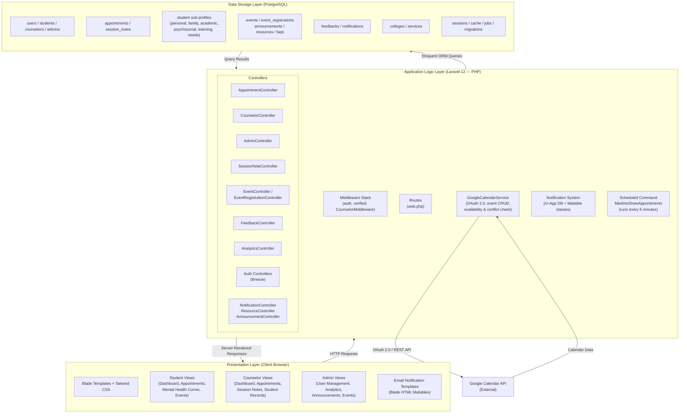

# Figure 4.1 — Three-Tier System Architecture of my.OGC

## Purpose
Shows the three-layer architecture of the platform: Presentation, Application Logic, and Data Storage.

## Chapter 4 Explanation
The my.OGC platform follows a web-based three-tier architecture. The Presentation Layer
handles all user-facing views rendered via Laravel Blade and Tailwind CSS. The Application
Logic Layer, built on Laravel 12, processes all requests through middleware, controllers,
and the GoogleCalendarService. The Data Storage Layer uses PostgreSQL accessed through
Laravel's Eloquent ORM.

## Assumptions
- None. All layers and components confirmed from codebase.

## Items Needing Confirmation
- None.

---

