# Figure 4.2 — Entity Relationship Diagram of my.OGC

## Purpose
Shows the data structure of the platform — the major entities, their attributes, and relationships.

## Chapter 4 Explanation
The ERD illustrates how the platform's data is organized. The `users` table is the central
entity, extended by role-specific profile tables (students, counselors, admins). Student
sub-profiles are normalized into six separate tables. Appointments link students and
counselors and carry the full booking lifecycle. Session notes are linked to appointments.
Events, announcements, resources, and feedback support content and engagement management.
Notifications are stored per-user with read/unread tracking.

## Assumptions
- `notifications` table uses Laravel's built-in polymorphic notifications table structure.
- `event_college` and `announcement_college` are pivot tables (confirmed from model relationships).
- `event_counselors` is a pivot table linking events to assigned counselors.

## Items Needing Confirmation
- None. All entities and relationships confirmed from model files and migrations count (61 files).

---

```mermaid
erDiagram
    USERS {
        bigint id PK
        string first_name
        string last_name
        string email
        string password
        string role
        string phone_number
        string profile_picture
        timestamp email_verified_at
    }

    STUDENTS {
        bigint id PK
        bigint user_id FK
        bigint college_id FK
        string student_id
        string year_level
        string course
        string student_status
        boolean is_high_risk
        boolean initial_interview_completed
    }

    COUNSELORS {
        bigint id PK
        bigint user_id FK
        bigint college_id FK
        string position
        string credentials
        boolean is_head
        json availability
        string google_calendar_id
        int daily_booking_limit
    }

    ADMINS {
        bigint id PK
        bigint user_id FK
        string credentials
    }

    COLLEGES {
        bigint id PK
        string name
        string code
    }

    APPOINTMENTS {
        bigint id PK
        string case_number
        bigint student_id FK
        bigint counselor_id FK
        date appointment_date
        time start_time
        time end_time
        string booking_type
        string booking_category
        string status
        bigint referred_to_counselor_id FK
        bigint original_counselor_id FK
        string google_calendar_event_id
        date proposed_date
        boolean is_appointment_high_risk
    }

    SESSION_NOTES {
        bigint id PK
        bigint appointment_id FK
        bigint counselor_id FK
        bigint student_id FK
        string session_type
        string mood_level
        text notes
        json root_causes
        text follow_up_actions
        date session_date
        date next_session_date
        boolean requires_follow_up
    }

    STUDENT_PERSONAL_DATA {
        bigint id PK
        bigint student_id FK
    }

    STUDENT_FAMILY_DATA {
        bigint id PK
        bigint student_id FK
    }

    STUDENT_ACADEMIC_DATA {
        bigint id PK
        bigint student_id FK
    }

    STUDENT_PSYCHOSOCIAL_DATA {
        bigint id PK
        bigint student_id FK
    }

    STUDENT_LEARNING_RESOURCES {
        bigint id PK
        bigint student_id FK
    }

    STUDENT_NEEDS_ASSESSMENT {
        bigint id PK
        bigint student_id FK
    }

    COUNSELOR_SCHEDULE_OVERRIDES {
        bigint id PK
        bigint counselor_id FK
        date date
        boolean is_closed
        json time_slots
    }

    EVENTS {
        bigint id PK
        bigint user_id FK
        string title
        date event_start_date
        date event_end_date
        boolean is_required
        boolean for_all_colleges
        json year_levels
        string google_calendar_event_id
    }

    EVENT_REGISTRATIONS {
        bigint id PK
        bigint event_id FK
        bigint student_id FK
        string status
        timestamp registered_at
    }

    ANNOUNCEMENTS {
        bigint id PK
        bigint user_id FK
        string title
        text content
        boolean for_all_colleges
        json year_levels
        date start_date
        date end_date
        boolean is_active
    }

    RESOURCES {
        bigint id PK
        bigint user_id FK
        string title
        string category
        string link
        boolean is_active
    }

    FEEDBACKS {
        bigint id PK
        bigint user_id FK
        bigint target_counselor_id FK
        string service_availed
        int satisfaction_rating
        text comments
        boolean is_anonymous
        int sqd0
        int sqd1
    }

    NOTIFICATIONS {
        uuid id PK
        string type
        string notifiable_type
        bigint notifiable_id
        json data
        timestamp read_at
    }

    FAQS {
        bigint id PK
        bigint user_id FK
        string question
        text answer
    }

    SERVICES {
        bigint id PK
        string name
        text description
    }

    USERS ||--o| STUDENTS : "has one"
    USERS ||--o| COUNSELORS : "has one"
    USERS ||--o| ADMINS : "has one"
    STUDENTS }o--|| COLLEGES : "belongs to"
    COUNSELORS }o--|| COLLEGES : "belongs to"
    STUDENTS ||--o| STUDENT_PERSONAL_DATA : "has one"
    STUDENTS ||--o| STUDENT_FAMILY_DATA : "has one"
    STUDENTS ||--o| STUDENT_ACADEMIC_DATA : "has one"
    STUDENTS ||--o| STUDENT_PSYCHOSOCIAL_DATA : "has one"
    STUDENTS ||--o| STUDENT_LEARNING_RESOURCES : "has one"
    STUDENTS ||--o| STUDENT_NEEDS_ASSESSMENT : "has one"
    STUDENTS ||--o{ APPOINTMENTS : "has many"
    COUNSELORS ||--o{ APPOINTMENTS : "has many"
    APPOINTMENTS ||--o{ SESSION_NOTES : "has many"
    COUNSELORS ||--o{ SESSION_NOTES : "has many"
    STUDENTS ||--o{ SESSION_NOTES : "has many"
    COUNSELORS ||--o{ COUNSELOR_SCHEDULE_OVERRIDES : "has many"
    STUDENTS ||--o{ EVENT_REGISTRATIONS : "has many"
    EVENTS ||--o{ EVENT_REGISTRATIONS : "has many"
    USERS ||--o{ FEEDBACKS : "has many"
    USERS ||--o{ ANNOUNCEMENTS : "has many"
    USERS ||--o{ RESOURCES : "has many"
    USERS ||--o{ FAQS : "has many"
    USERS ||--o{ NOTIFICATIONS : "has many"
```

