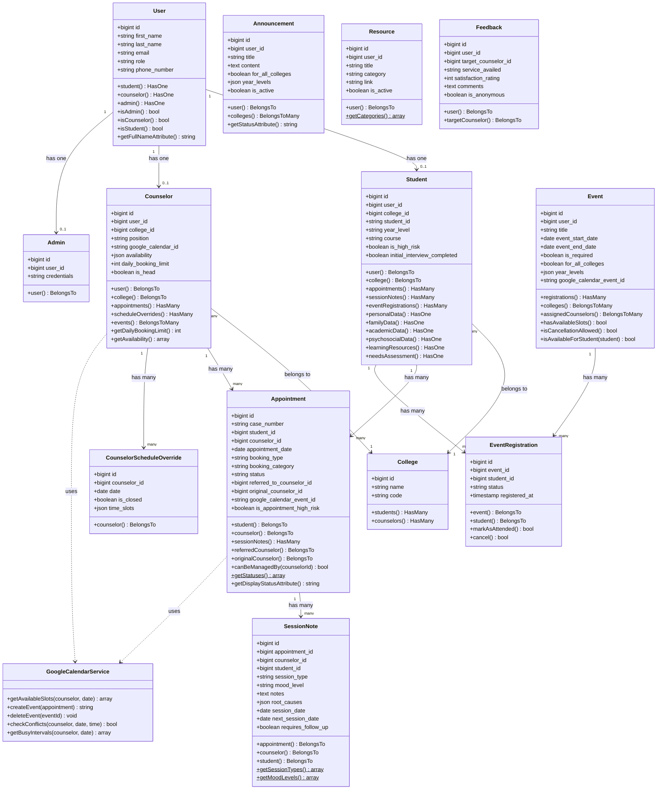

# Figure 4.3 — Class Diagram of my.OGC

## Purpose
Shows the object-oriented structure of the platform — the major Eloquent model classes,
their key attributes, methods, and relationships.

## Chapter 4 Explanation
The class diagram presents the major Laravel Eloquent model classes used in my.OGC.
The `User` class is the central class, extended by role-specific profile classes: `Student`,
`Counselor`, and `Admin`. The `Appointment` class connects `Student` and `Counselor` and
carries the full booking lifecycle including referral and reschedule tracking. `SessionNote`
is linked to both `Appointment` and `Student`. Supporting classes include `Event`,
`EventRegistration`, `Announcement`, `Resource`, `Feedback`, `College`, and
`CounselorScheduleOverride`.

## Assumptions
- Only key attributes and methods are shown for readability. Full attribute lists are in the ERD.
- GoogleCalendarService is shown as a service class, not an Eloquent model.

## Items Needing Confirmation
- None. All classes confirmed from model files.

---

