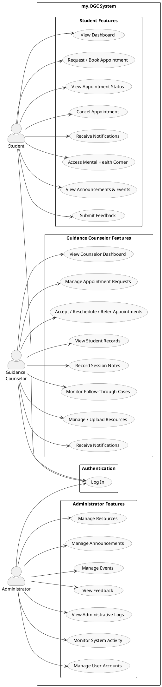
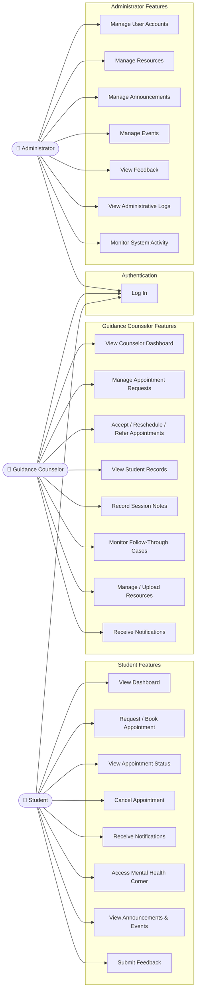

# Figure 4.4 — Use Case Diagram of my.OGC

## Purpose
Shows the interactions between the three primary system actors and the platform's features.

## Chapter 4 Explanation
The use case diagram illustrates the three primary actors of my.OGC: Student, Guidance
Counselor, and Administrator. Each actor interacts with a distinct but overlapping set of
system features. Students can log in, book and manage appointments, access the Mental Health
Corner, view announcements and events, receive notifications, and submit feedback. Guidance
Counselors manage appointment requests — they can accept, reschedule, or refer appointments to
another counselor, but cannot outright reject them — record session notes, view student records,
monitor follow-through cases, manage and upload resources, and receive notifications. Administrators
oversee user accounts, resources, announcements, events, feedback, and system-wide activity.
Both Guidance Counselors and Administrators can manage resources, as confirmed by the presence
of dedicated resource management controllers for each role (ResourceController and
AdminResourceController). Student Peer Facilitators participated in the study as evaluators
only and are not primary system actors.

---

## Use Cases by Actor

### Student
- Log in
- View dashboard
- Request / book appointment
- View appointment status
- Cancel appointment
- Receive notifications
- Access Mental Health Corner
- View announcements and events
- Submit feedback

### Guidance Counselor
- Log in
- View counselor dashboard
- Manage appointment requests
- Accept / reschedule / refer appointments
- View student records
- Record session notes
- Monitor follow-through cases
- Manage / upload resources *(confirmed — ResourceController routes to counselor.resources views)*
- Receive notifications

### Administrator
- Log in
- Manage user accounts
- Manage resources *(confirmed — AdminResourceController)*
- Manage announcements
- Manage events
- View feedback
- View administrative logs
- Monitor system activity

---

## Items Needing Confirmation
- None. All use cases verified against implemented controllers.

---

---

## Mermaid Version (alternative rendering)

