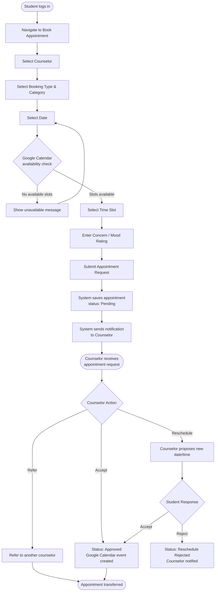

# Figure 4.5–4.8 — Activity Diagrams of my.OGC

---

## Figure 4.5 — Student Appointment Booking Activity Diagram

### Purpose
Shows the step-by-step flow when a student books a counseling appointment.

### Chapter 4 Explanation
The student appointment booking workflow begins when a student logs in and navigates to
the booking page. The system checks counselor availability via Google Calendar before
allowing the student to submit a request. Once submitted, the counselor receives a
notification and can accept, reschedule, or refer the appointment to another counselor.
Counselors cannot outright reject an appointment.

### Assumptions
- Google Calendar check is mandatory before a slot can be selected (confirmed from GoogleCalendarService).
- Booking types: Initial Interview, Counseling, Consultation.
- Booking categories: online, walk-in, referred, called-in.

### Items Needing Confirmation
- None.

---



---

## Figure 4.6 — Counselor Appointment Management Activity Diagram

### Purpose
Shows how a guidance counselor manages incoming appointment requests.

### Chapter 4 Explanation
The counselor appointment management workflow shows how counselors review pending
requests and take action. Counselors can accept, reschedule, or refer appointments
to another counselor — they cannot outright reject an appointment. Referrals require
the receiving counselor to accept or reject. Completed appointments can have session
notes recorded.

### Assumptions
- Referral workflow requires explicit acceptance or rejection from the receiving counselor.
- No-show marking is also handled by a scheduled background command.

### Items Needing Confirmation
- None.

---

```mermaid
flowchart TD
    A([Counselor logs in]) --> B[View Appointment Dashboard]
    B --> C[Filter / Search Appointments]
    C --> D[Select Pending Appointment]
    D --> E{Action}

    E -- Accept --> F[Status: Approved\nGoogle Calendar event created\nStudent notified]
    E -- Reschedule --> H[Propose new date/time\nStatus: Reschedule Requested\nStudent notified]
    E -- Refer --> I[Select receiving counselor\nEnter referral reason\nStatus: Referred\nBoth parties notified]

    H --> J{Student Response}
    J -- Accept --> F
    J -- Reject --> K[Status: Reschedule Rejected\nCounselor notified]

    I --> L{Receiving Counselor Response}
    L -- Accept --> M[Appointment transferred\nStudent notified]

    F --> O{Appointment Date Passes}
    O -- Student attended --> P[Mark as Completed\nRecord Session Notes]
    O -- Student did not attend --> Q[Mark as No-Show\n(manual or auto via scheduler)]

    P --> R([Session Note saved\nFollow-up scheduled if needed])
```

---

## Figure 4.7 — Counseling Session Documentation Activity Diagram

### Purpose
Shows how a counselor records session notes after a completed appointment.

### Chapter 4 Explanation
After an appointment is marked as completed, the counselor can record a session note
linked to that appointment. The note captures session type, mood level, root causes,
follow-up actions, and the next session date if a follow-up is required.

### Assumptions
- Session notes are linked to both the appointment and the student.
- Multiple session notes can be recorded per appointment.

### Items Needing Confirmation
- None.

---

```mermaid
flowchart TD
    A([Counselor opens completed appointment]) --> B[Click 'Add Session Note']
    B --> C[Select Session Type\n(Initial, Follow-up, Crisis, Regular)]
    C --> D[Select Mood Level]
    D --> E[Enter Notes / Observations]
    E --> F[Enter Root Causes]
    F --> G[Enter Follow-up Actions]
    G --> H{Requires Follow-up?}
    H -- Yes --> I[Set Next Session Date]
    H -- No --> J[Leave next session date blank]
    I --> K[Save Session Note]
    J --> K
    K --> L[System links note to appointment\nand student record]
    L --> M{High-Risk Indicators?}
    M -- Yes --> N[Counselor toggles High-Risk Flag\nAdds notes]
    M -- No --> O([Session note saved])
    N --> O
```

---

## Figure 4.8 — Mental Health Corner Access Activity Diagram

### Purpose
Shows how students access wellness resources through the Mental Health Corner.

### Chapter 4 Explanation
The Mental Health Corner provides students with a low-barrier way to access mental health
and wellness resources without requiring a formal appointment. Students can browse
resources by category (YouTube videos, eBooks, curated videos, OGC resources) and
access external links or embedded content.

### Assumptions
- No login-gated content beyond the standard authentication requirement.
- Resources are managed by counselors and administrators.

### Items Needing Confirmation
- None.

---

```mermaid
flowchart TD
    A([Student logs in]) --> B[Navigate to Mental Health Corner]
    B --> C[View resource categories\n(YouTube, eBooks, Curated Videos, OGC Resources)]
    C --> D[Select a category]
    D --> E[Browse resources in category]
    E --> F[Select a resource]
    F --> G{Resource type}
    G -- External link / YouTube --> H[Open resource in new tab]
    G -- Downloadable file --> I[Download file]
    G -- Embedded video --> J[Play video in-page]
    H --> K([Student accesses resource])
    I --> K
    J --> K
    K --> L{Continue browsing?}
    L -- Yes --> C
    L -- No --> M([Exit Mental Health Corner])
```
