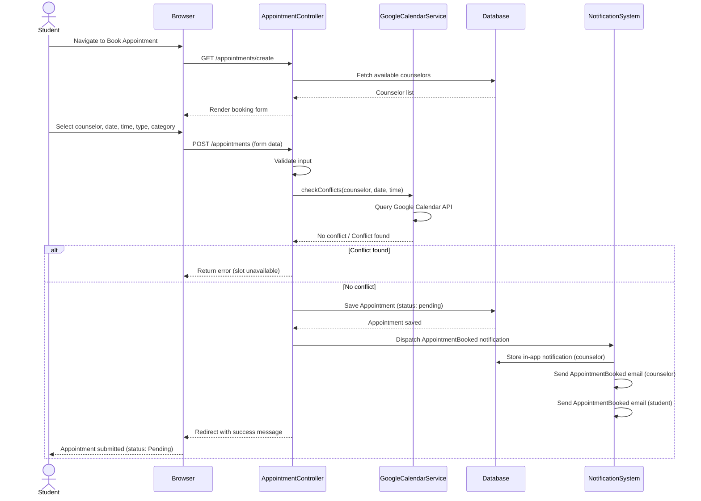
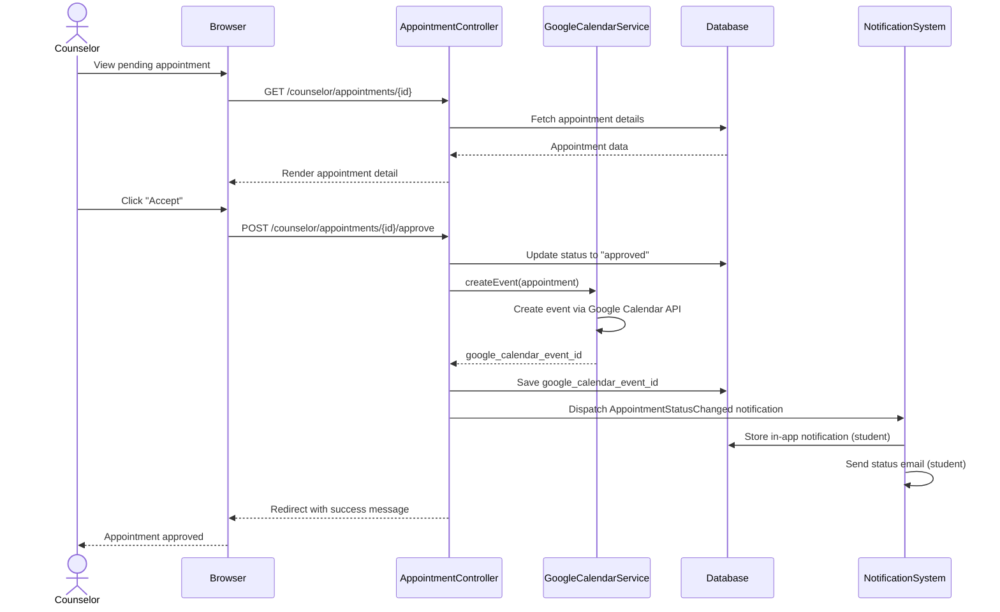
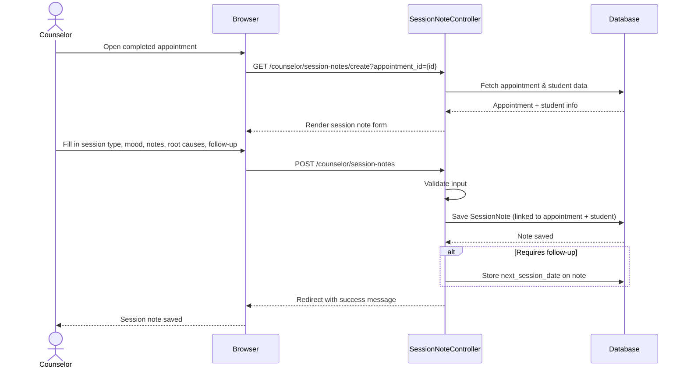
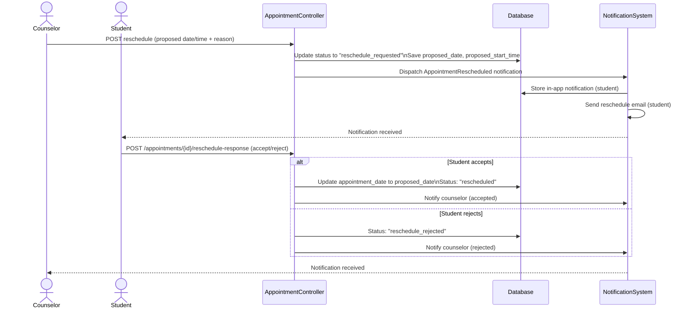

# Sequence Diagrams — my.OGC

---

## Sequence Diagram 1 — Student Books an Appointment

### Purpose
Shows the message flow between the Student, the system (Laravel), GoogleCalendarService,
and the Counselor when a student books an appointment.

### Chapter 4 Explanation
When a student submits an appointment request, the system validates the input, checks
counselor availability through the GoogleCalendarService, saves the appointment record,
and dispatches notifications to both the student and the counselor.

### Assumptions
- Google Calendar check happens before the appointment is saved.
- Notification is sent via both in-app (database) and email (Mailable).

### Items Needing Confirmation
- None.

---

---

## Sequence Diagram 2 — Counselor Accepts an Appointment

### Purpose
Shows the message flow when a counselor accepts a pending appointment request.

### Chapter 4 Explanation
When a counselor accepts an appointment, the system updates the appointment status to
Approved, creates a Google Calendar event, and notifies the student. Counselors cannot
reject appointments — they may only accept, reschedule, or refer to another counselor.

### Assumptions
- Google Calendar event creation is part of the accept flow.
- Notification is sent via both in-app and email.

### Items Needing Confirmation
- None.

---

---

## Sequence Diagram 3 — Counselor Records a Session Note

### Purpose
Shows the message flow when a counselor records a session note after a completed appointment.

### Chapter 4 Explanation
After an appointment is completed, the counselor opens the session note form, fills in
the required fields, and saves the note. The system links the note to both the appointment
and the student record.

### Assumptions
- Session notes can only be created for appointments that exist in the system.
- High-risk flag update is a separate action after saving the note.

### Items Needing Confirmation
- None.

---

---

## Sequence Diagram 4 — Student Receives and Responds to a Reschedule Request

### Purpose
Shows the message flow for the reschedule workflow between counselor and student.

### Chapter 4 Explanation
When a counselor proposes a reschedule, the appointment status changes to
"reschedule_requested" and the student is notified. The student can accept or reject
the proposed new schedule.

### Assumptions
- Reschedule cutoff is enforced at the application level.
- Both accept and reject paths notify the counselor.

### Items Needing Confirmation
- None.

---

